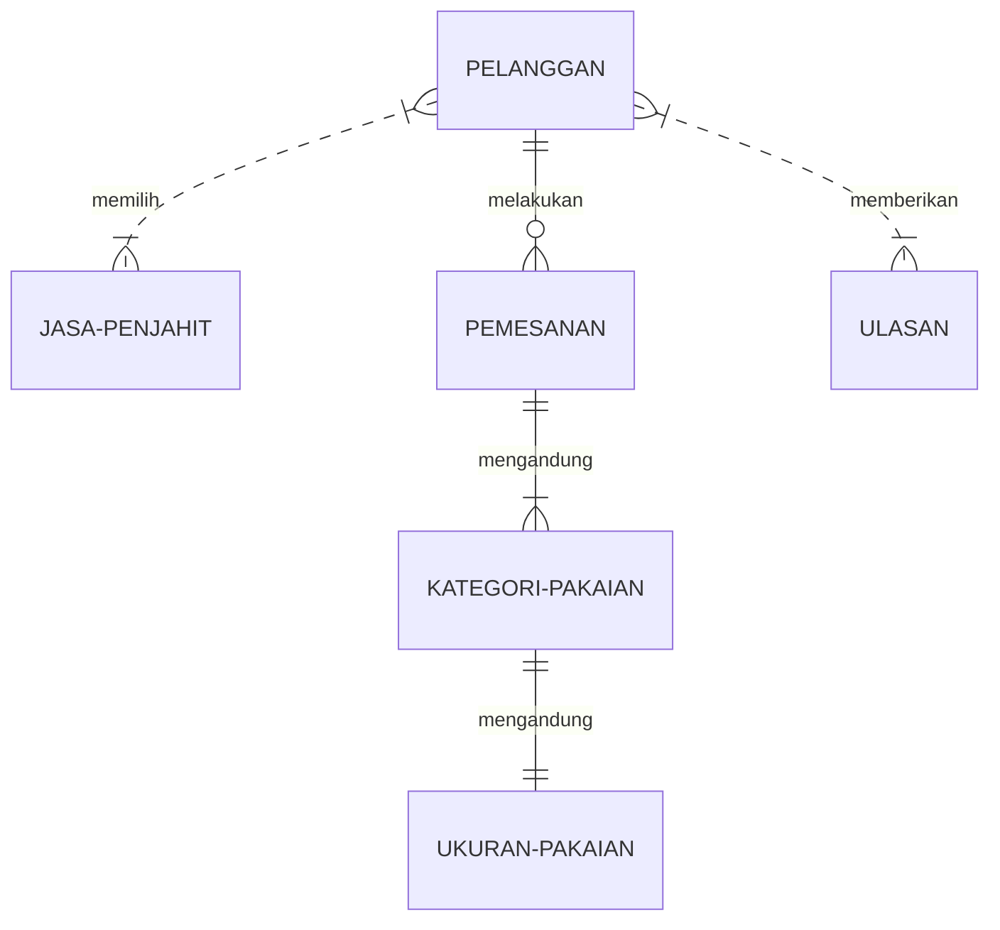

## 1.1 Latar Belakang

Aplikasi "JahitKu" merupakan aplikasi android yang dibuat dari ide yang muncul dari inspirasi saya pribadi. Saya dimotivasi oleh pengalaman keluarga (Ibu) yang terlibat dalam usaha jasa jahit. Semakin berkembangnya era digital, penggunaan teknologi telah menjadi semakin penting dalam berbagai aspek kehidupan, termasuk dalam menjalankan bisnis yang bisa dibilang tradisional seperti usaha jasa jahit.

Aplikasi "JahitKu" ini termasuk dalam perubahan tren dalam kehidupan sehari-hari. Seiring dengan berkembangnya teknologi, pelanggan cenderung mencari cara yang lebih efisien, nyaman, dan cepat untuk mendapatkan layanan dan produk yang mereka butuhkan. Sehingga, aplikasi "JahitKu" dibuat untuk menyatukan antara kebiasaan masyarakat dalam kehidupan sehari-hari dan teknologi dengan tujuannya yaitu memenuhi kebutuhan pelanggan yang semakin beragam serta mendukung kelangsungan usaha jasa jahit.

## 1.2. Deksripsi Teknologi Informasi

Aplikasi "JahitKu" dibuat dengan tujuan memudahkan interaksi antara pelanggan dan penjahit. Pelanggan dapat menemukan penjahit terdekat sekaligus terbaik untuk melakukan pesanan jahit. Dengan ini, pelanggan tidak perlu khawatir lagi untuk memperbaiki pakaiannya. Selain itu juga, pelanggan dapat berkonsultasi secara jarak jauh sehingga bisa menyesuaikan sesuai dengan kebutuhan dalam pakaiannya.

Aplikasi "JahitKu" ini dapat membantu penjahit dan pelangannya dalam mengelola pesanan dan komunikasi yang lebih efesien. Hal ini akan memungkinkan penjahit untuk meningkatkan layanan yang berkualitas agar bisnisnya berjalan dengan baik. Selain itu, aplikasi "JahitKu" dibuat bertujuan untuk mendukung usaha kecil yaitu usaha jasa jahit, sehingga dapat bersaing satu sama lain yang semakin kompetitif.

Dengan adanya ulasan dari pelanggan melalui aplikasi, penjahit dapat memperbaiki kualitas layanan mereka dan memenuhi harapan pelanggan dengan lebih baik. Aplikasi "JahitKu" ini diharapkan dapat bisa mengikuti era digital yang sudah berkembang. Sehingga dapat mempertahankan bisnis penjahit, memberikan kemudahan, dan ataupun meningkatkan potensi jasa jahit.

## 1.3. Branding
- Merk: JahitKu
- Tagline: Kostum pakaian dan jelajahi penjahit lokal terbaik
- Campaign: Aplikasi yang penggunanya dapat memilih penjahit terbaik, terdekat, serta transaksi penjahit dan pelanggan secara adil dan aman
- Target user:
	- Usia
	- Seorang yang membutuhkan jasa jahit
	- Seorang yang mempromodikan jasa jahitnya
	- Seorang yang senang menjelajahi pakaian kostum
	- Seorang yang ingin transaksi pelanggan dan penjahit secara adil dan aman
- User experience theme:
	- Tenang
	- Segar
	- Netral
	- Warna: Palet warna krem, lavender, dan abu-abu tua

## 2. User Story
Sebagai | Saya ingin bisa | Sehingga | Prioritas
---|---|---|---
Pengguna | Melakukan daftar akun | Mempunyai akun untuk login | ⭐⭐⭐⭐⭐
Pengguna | Melakukan login | Bisa menggunakan aplikasi | ⭐⭐⭐⭐⭐
Pengguna | Mengecek saldo | Memudahkan ketika ingin melakukan pesanan | ⭐⭐⭐⭐⭐
Pengguna | Mengisi saldo | Bisa membayar pesanan | ⭐⭐⭐⭐⭐
Pengguna | Menjelajahi jasa jahit | Bisa memilih jasa jahit | ⭐⭐⭐⭐⭐
Pengguna | Memilih kategori | Bisa memilih kategori pakaian yang ingin dijahit | ⭐⭐⭐⭐⭐
Pengguna | Mengunggah ukuran pakaian | Bisa diperiksa oleh penjahit | ⭐⭐⭐⭐⭐
Pengguna | Melakukan pemesanan | Bisa dikonfirmasi oleh penjahit | ⭐⭐⭐⭐⭐
Pengguna | Memasukkan ke keranjang | Memudahkan pengguna ketika tidak melakukan pemesanan | ⭐⭐⭐
Pengguna | Mengecek pesanan | Bisa mengetahui pesanan sudah sejauh mana | ⭐⭐⭐⭐⭐
Pengguna | Mengecek riwayat | Bisa mengetahui riwayat pesanan | ⭐⭐⭐
Pengguna | Mengecek keranjang | Memudahkan pengguna ketika ingin melakukan pesanan yang sebelumnya ingin dipesan | ⭐⭐⭐⭐
Pengguna | Melakukan obrolan (chat) dengan penjahit | Bisa mengkonfirmasi dan konsultasi | ⭐⭐⭐⭐⭐
Pengguna | Mencari nama penjahit untuk memulai obrolan | Mempermudah untuk langsung akses obrolan | ⭐⭐⭐
Pengguna | Mengedit profil | Dapat diketahui oleh pengguna yang lain | ⭐⭐⭐⭐
Pengguna | Memasukkan penjahit ke dalam favorit | Memudahkan pengguna untuk mencari penjahit yang menurutnya terbaik | ⭐⭐⭐
Pengguna | Melakukan rating | Bisa melihat dan dilihat kualitas penjahit | ⭐⭐⭐⭐⭐

## 3. Struktur Data

## 4. Arsitektur Sistem
flowchart TD
    Start --> Stop

## 5. Teknologi, Library, dan Framework
Teknologi dalam aplikasi "JahitKu" yaitu sebagai berikut.
1. JavaScript (bahasa pemrograman yang digunakan dalam aplikasi React Native)
2. React Native CLI Quickstart
3. Android Studio
4. Text Editor (Visual Studio Code)

Library
1. react-navigation/native
2. @react-navigation/native-stack
3. react
4. react-native
5. react-native-safe-area-context
6. react-native-screens

Framework
1. React Native

## 6. Desain User Experience dan User Interface

## 7. Demonstrasi Video

Link youtube nya

## 8. Bagaimana mesin komputasi dan sistem operasi berperan dalam produk teknologi informasimu ?

Link youtube nya di detik jawaban ini

## 9. Bagaimana algoritma, struktur data, dan bahasa pemrograman berperan dalam produk teknologi informasimu ?

Link youtube nya di detik jawaban ini

## 10. Bagaimana metode pengembangan perangkat lunak / Software Development Life Cycle berperan dalam produk teknologi informasimu ?

Link youtube nya di detik jawaban ini

## 11. Bagaimana database / sistem basis data berperan dalam produk teknologi informasimu ?

Link youtube nya di detik jawaban ini
